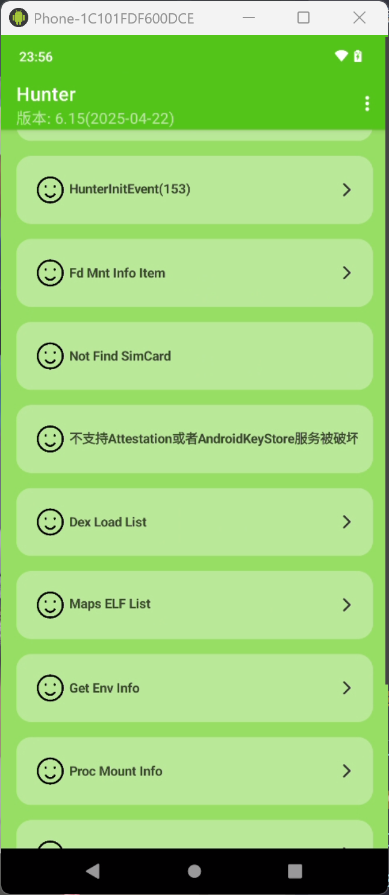
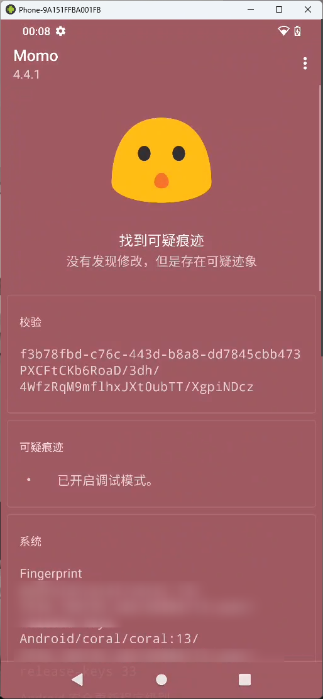
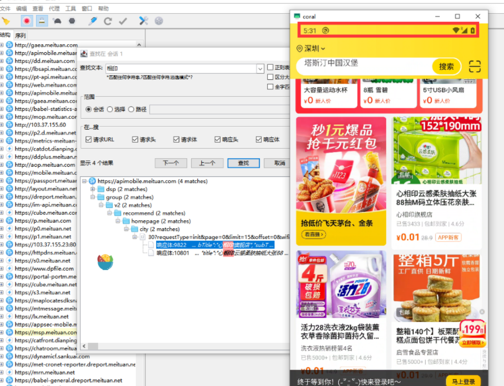
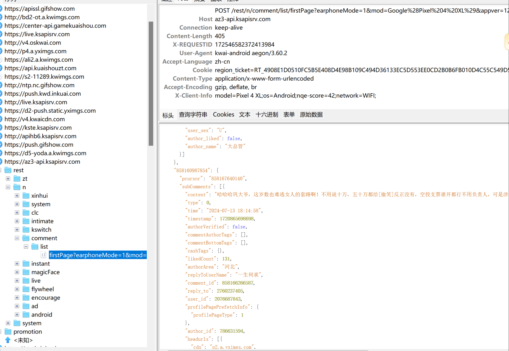
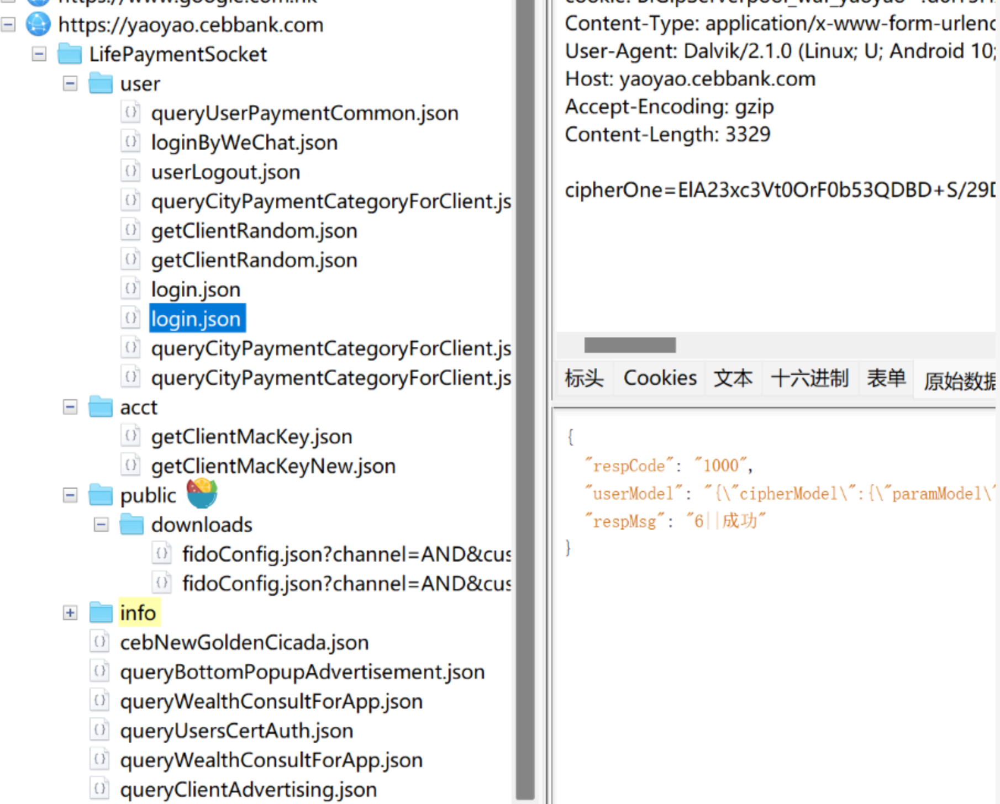
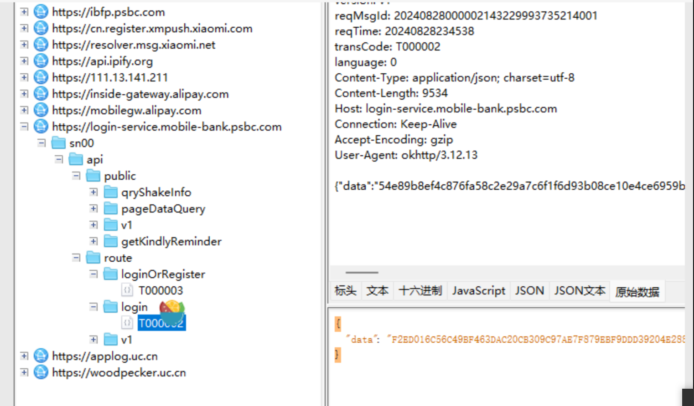
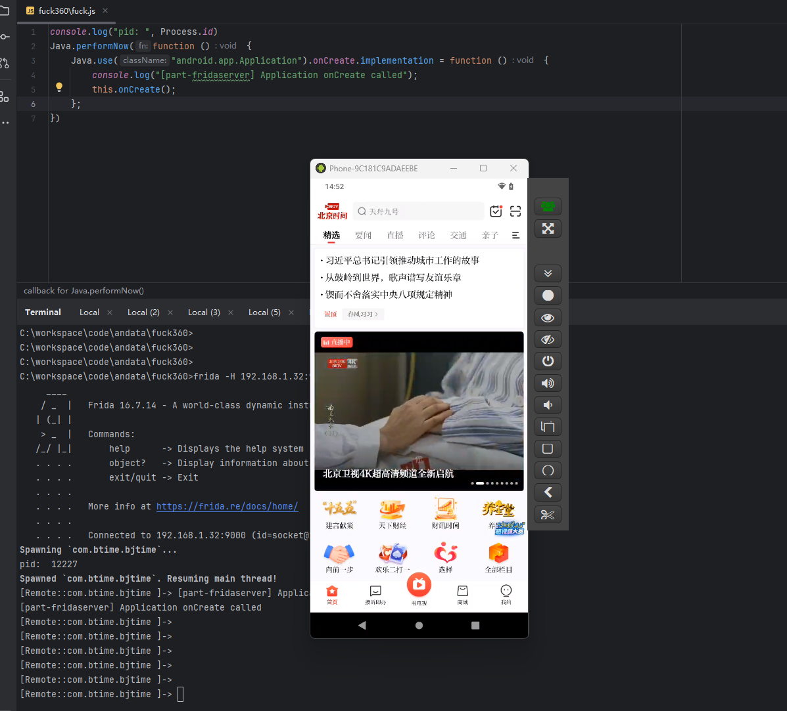

# PartImage

part镜像是一个专为逆向分析而生的安卓13系统、具备脱壳、定制抓包、定制frida等功能，

目前支持pixel 4/4XL 以及 pixel 6。

定制的联系QQ：328366802

## 环境

环境干干净净，自带内核级定制root，支持谷歌框架，在应用看来就是一台普通的手机。你不再需要为root检测、xposed检测、vpn检测、ksu检测、面具等等检测而烦恼。

<table>
  <tr>
    <td></td>
    <td></td>
  </tr>
</table>

# 系统配合定制的抓包软件
## mt

## ks

## 部分银行级别
<table>
  <tr>
    <td></td>
    <td></td>
  </tr>
</table>

# 脱壳
参考我帖子的案例：
https://bbs.kanxue.com/thread-282432.htm

## 定制版frida
0721-最近比较忙一直忘记更新了，这个月更新支持最新数字企业版frida检测通杀.此server不需要搭配part镜像，可以在其他root过的手机上使用。
目前通杀最新版杀360、梆梆、爱加密。更多厂商尽在开发中......

其他的参考我帖子的案例：
https://bbs.kanxue.com/thread-285628.htm
